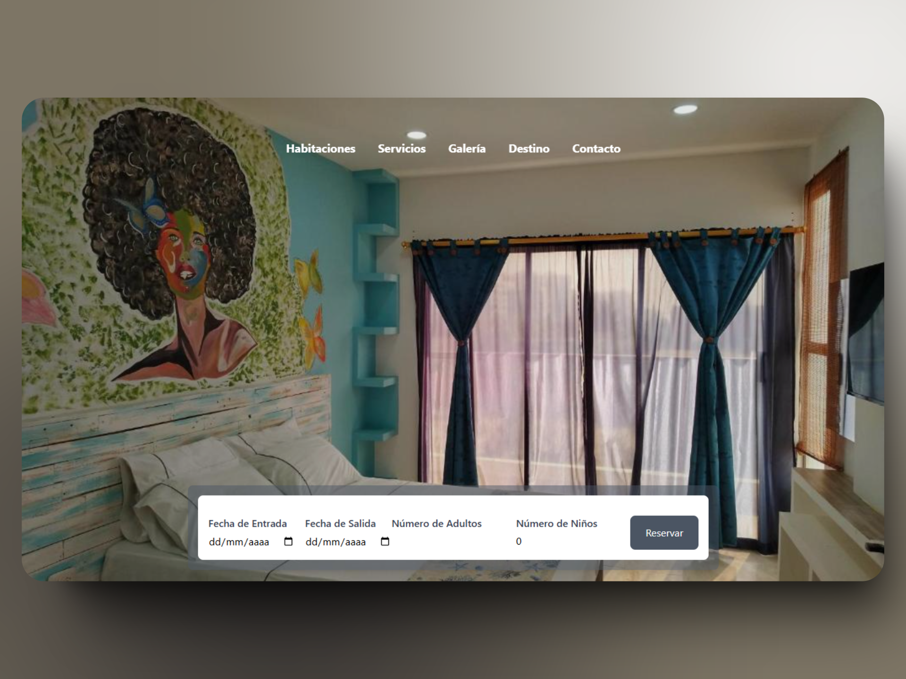

# Sistema de Reservas para Hotel

Se requiere un sistema de reservas de apartamentos para un hotel. El sistema debe gestionar la información de los clientes, solicitando los datos necesarios para realizar reservas exitosas.

Condiciones de Reserva:

- El máximo de noches permitidas por reserva es de 5.
- Si el cliente desea reservar más de 5 noches, el sistema deberá indicarle que contacte directamente al hotel para recibir atención personalizada.

Este sistema tiene como objetivo facilitar el proceso de reserva, garantizando un registro eficiente de las solicitudes y optimizando la experiencia del cliente.

